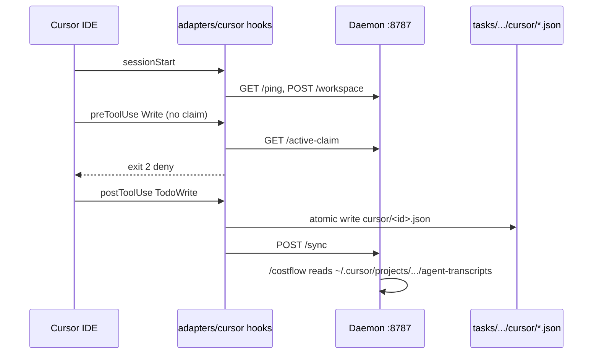

# Cursor adapter — end-to-end integration

CI-safe proof that the Cursor harness stack works together without a live Cursor IDE.
Automated coverage lives in `test/cursor-e2e-integration.test.js`; this doc maps each
layer to what the test asserts.

## Stack under test

| Layer | Deliverable | Role |
|---|---|---|
| H1 | `adapters/cursor/*.sh` + `hooks.json.sample` | Relay Cursor hook events to the daemon (gate, workspace bind, subagent lifecycle) |
| H2 | `adapters/cursor/post-todo-adopt.sh` + `.cursor/hooks.json` | Mint `cursor/<id>.json` file-drop stubs from `TodoWrite` / `todo_write` |
| D2 | `lib/cursor-transcripts.js` + `lib/adapters/cursor.js` | Discover and parse Cursor transcript JSONLs for cost attribution |

## Flow (what happens in a real session)



## Test matrix (no live IDE)

| Case | How tested |
|---|---|
| H1 hooks wired | `hooks.json.sample` references every relay script; project `.cursor/hooks.json` wires `post-todo-adopt.sh` |
| `sessionStart` → `/workspace` | Pipe Cursor-shaped JSON into `session-start.sh` against a sandbox daemon; `/health` shows workspace + `mainTranscript` |
| Gate denies unclaimed write | `orch-gate.sh` with `conversation_id`, stub `curl` returning `claimed:false` + `is_subagent:true` → exit 2 |
| H2 todo mint | Fixture `TodoWrite` stdin → `post-todo-adopt.sh` writes stubs under `tasks/<ws-key>/cursor/` |
| D2 + costflow | Fixture transcript under `~/.cursor/projects/<encoded>/agent-transcripts/`; daemon with `ZONOID_HARNESS=cursor` → `/costflow` reports `human` tokens and session catchalls |

## Running locally

```bash
node test/cursor-e2e-integration.test.js
```

Sibling unit tests (also CI-safe):

- `test/cursor-session-normalizer.test.js` — `lib.sh` field normalization
- `test/cursor-transcript-reader.test.js` — D2 path discovery and parsing
- `test/filedrop-daemon.test.js` — cursor stub tasks in the graph

## Install checklist (manual, not required for CI)

1. Copy `adapters/cursor/hooks.json.sample` → `.cursor/hooks.json` (replace `__INSTALL_DIR__`).
2. Merge `postToolUse` entry from this repo's `.cursor/hooks.json` for H2 minting.
3. `chmod +x adapters/cursor/*.sh`
4. Trust the workspace in Cursor so project hooks run.
5. Ensure orchestrator MCP is configured and daemon reachable at `localhost:8787`.

## Related docs

- `adapters/cursor/README.md` — hook mapping table
- `docs/cursor-compat-spike.md` — payload deltas and IDE vs CLI gaps
- `docs/adapter-contract.md` — daemon endpoint contract
